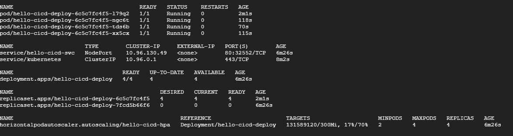

# hello-world ci-cd

This repo contains a simple hello-world java application around which a ci-cd pipeline is created using **jenkins, maven, nexus and docker**.

## Setup

All the tools as well as the application is hosted on a GCP virtual machine, the steps to login to the vm have been shared over the mail.

There is a [tools.sh](https://github.com/abhinav9842/hello-cicd/blob/main/ci-cd-stack/tools.sh) script present inside the ci-cd stack directory which pretty much installs and configures all the tools necessary for the pipeline. This script can be used to configure tools on a fresh vm.

## Application
The application is a simple hello-world app which is written in java. This app is currently deployed on a kubernetes cluster and exposed via NodePort you can [click here](http://35.200.152.152:31412/) to view the hosted app.

## Kubernetes
I have setup a 3 node kubernetes cluster to deploy the application. The cluster has one master node and 2 worker node. Its a unmanaged cluster created via Kubeadm.

 

A deployment and a service is created inside the cluster to host the app. You can view the manifest by [clicking here](https://github.com/abhinav9842/hello-cicd/blob/main/kube-manifest.yaml)

The deployment manifest also has liveness and readiness probe to ensure the container is ready and live before accepting any traffic. Also I have configured HPA to take care of scaling. 
The application is exposed via NodePort since this is a unmanaged cluster.

## Anchore

For Image scanning I have used anchore. This service is hosted as a docker-compose object. The compose yaml can be easily sourced from Anchore documentation. Anchore has a plugin for jenkins which makes it easy for us to see the report right from the jenkins ui itself. 

The built image is uploaded onto a staging nexus private docker repo and from there Anchore downloads the image and scans it. Based on the result pipeline can be stopped if there are major issues with the image. The report then can also be seen on the jenkins ui. 

## Pipeline
I have used **jenkins** to create the ci-cd pipeline, the scripted code is present in [Jenkinsfile](https://github.com/abhinav9842/hello-cicd/blob/main/Jenkinsfile). The pipeline can be manually triggered as well as a webhook is also configured so whenever someone checks in the code the job runs automatically.

The pipeline mainly has 6 stages
- **Build** - In this stage I am cloning the repo and use mvn package goal to compile and package the jar
- **Unit testing** - By using mvn test goal I am testing the application. Test failing will result in a failed build. 
- **Docker Image** - In this step I am containerizing the java application. You can go through the [Dockerfile](https://github.com/abhinav9842/hello-cicd/blob/main/Dockerfile) to see the all instructions used to build the image.
- **Scan Image** - In this step I am uploading the built image onto a staging repo in nexus and then I am using Anchore to scan the uploaded image Based on the result pipeline can be stopped if there are major issues with the image. The report then can also be seen on the jenkins ui. 
- **Artifact upload** - It is very important to store the artifacts created in a separate repo. In this stage I am uploading the Docker Image on to the private docker registry hosted on nexus. I am using build number to tag the images to make sure images are unique.
- **Deploy** - In this stage I am deploying the application onto the kubernetes cluster using kubectl set image command and specifying the current built image. The application is already exposed through nodeport service. The deployment takes care of updating the pods in a highly available manner using rolling update strategy.

## Usage

You can access jenkins by [clicking here](http://34.131.24.68:8080/)

Nexus can be accessed from [here](http://34.131.24.68:8081/#browse/browse)

The credentials for both have been shared over the mail.